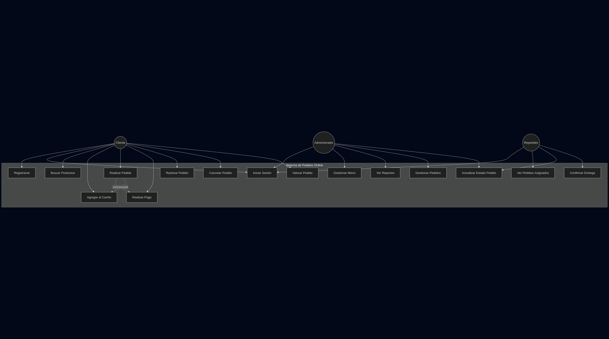
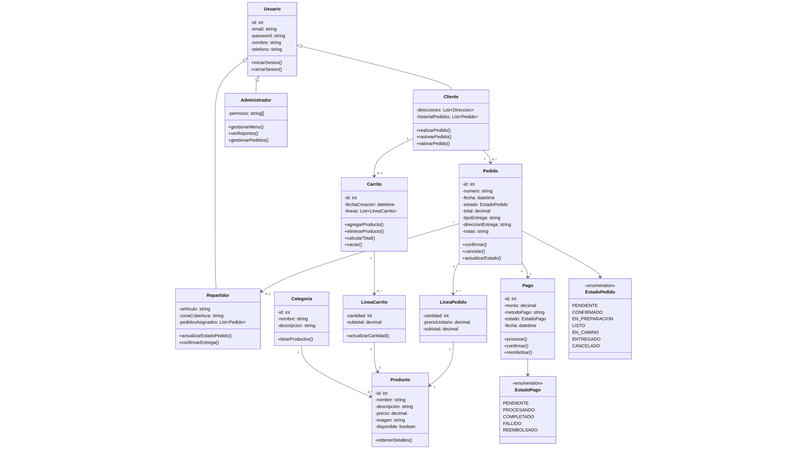
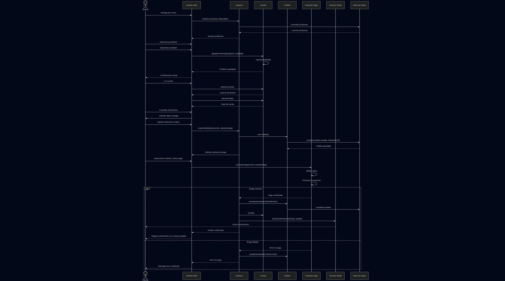

# WEB "COMO EN CASA" -- Projecte intermodular
## Alumnes:
* Silvia Moreno
* Biel Camarena
* Màxim Escrivá

---

# INDEX

[1. Investigació de necessitats i problemes](#1-investigació-de-necessitats-i-problemes) 
[2. Proposta de solució](#2-proposta-de-solució) 
[3. Esquema inicial de la web](#3-esquema-inicial) 
[4. Objectius](#objectius) 
[5. Diagrames UML](#diagrames-uml-casos-dús-i-components) 
[6. Experiència d'usuari](#definició-de-lexperiència-de-lusuari-uxui) 

---

# 1. Investigació de necessitats i problemes

El objectiu es **identificar els problemes** que puguen trobar-se en una **empresa que crea menjars per portar** o recollir.

### Entrevistes:

Gràcies a les entrevistes hem realitzat i a la informació que hem trobat a internet, hem pogut identificar una sèrie de problemes que venen amb un negoci com aquest.

* El negoci necessita **donar-se a conèixer**, ja siga amb publicitat o boca-a-boca.

* Necessita **presentar** què **productes** tenen i què **servei** presta.

* **Gestió de les futures reserves** que es fajen, ja siga per telèfon o web.

* **Gestió dels torns de treball** i com comunicar-los als treballadors.

---

# 2. Proposta de solució

Amb la mena de problemes que hem trobat, hem pensat algunes solucions a aquestes:

| Necessitats o problemes       | Departament         | Solucions proposades                                                                                                                                                                 |
| ----------------------------- | ------------------- | ------------------------------------------------------------------------------------------------------------------------------------------------------------------------------------ |
| Promocionar-se                | Marketing           | Crear una pàgina web i perfil de xarxes socials, atractives que informen als potencials clients i que puguen compartir.                                                              |
| Presentar productes i serveis | Marketing, vendes   | A la pàgina web, mostrar els productes, com es fan, què contenen, alèrgens, com pot servir-se al client (a domicili, a recollir)                                                     |
| Gestió de reserves            | Vendes              | Crear una pàgina o app on els clients puguen concretar quan volen que se'ls servisca el producte desitjat, on volen que se l'envien si és a domicili...                              |
| Gestió dels torns de treballs | Administració, RRHH | Pàgina privada on estiguen disponibles el plà de torns de eixa setmana o mes, pujades per l'administració o gestor (manager) del negoci, en cas de que hi siguen molts treballadors. |

---

# 3. Esquema inicial

Donades totes aquestes dades, hem pensat en un model *bàsic* de com fer la **pàgina web** per a una **empresa de preparació i lliurament de menjars per portar o a domicili.**

| PLATAFORMA WEB                          | FUNCIONALITATS                                                                                                                                                                                                                                                                                             |
| --------------------------------------- |:---------------------------------------------------------------------------------------------------------------------------------------------------------------------------------------------------------------------------------------------------------------------------------------------------------- |
| Pàgina d'inici                          | Presentar l'empresa i seccions: catàleg de productes disponibles, quines ofertes hi han, sistema de reserves online, informació de contacte i ubicació...                                                                                                                                                  |
| Catàleg de productes                    | Presentar què ofereix l'empresa i com, fitxes detallades amb els plats o menjars, què alèrgens té cada plat, de què ingredients està fet... Una carta d'on escollir, bàsicament. Ací es podrà filtrar per categories i buscar productes concrets.                                                      |
| Sistema de reserves online              | Pàgina on els clients podran seleccionar els productes i l'hora desitjada quan volen que se'ls porten o recollir, quantitat, mètode de lliurament, dades de contacte, comentaris, càlcul automàtic de preu...                                                                                              |
| Panel de gestió de reserves             | Vista de calendari amb totes les reserves, estat de la comanda, historial de comandes...                                                                                                                                                                                                                   |
| Contacte                                | Una pàgina senzilla on el client trobarà com contactar amb l'empresa per correu o telèfon i l'ubicació del local, amb Google Maps.                                                                                                                                                                         |
| Àrea privada per als empleats i gestors | Accés mitjançant login segur (usuari i contrasenya), amb dos rols diferenciats: administrador (control total) i empleats (sols visualització). Ací es podrà accedir a la creació de torns semanals o mensuals, l'assignació dels empleats a torns, la visualització del horari per als treballadors... |

L'objectiu és crear una pàgina web que siga atractiva i fàcil de entendre i navegar, que cride l'atenció de l'usuari/client, amb botons de crida a l'acció (accés a ofertes, carta, comandes...).

# 4. Objectius

Els objectius d'aquesta pràctica són:

1. Dissenyar l'arquitectura tècnica del projecte.

2. Crear diagrames UML basats en els requisits del projecte.

3. Desenvolupar interfícies intuïtives i atractives centrades en una experiència d'usuari fluïda i eficient.

4. Assgurar la coherència del disseny amb els objectius del projecte.

## Requisits:

| WEB                                     | Funcionalitat                                                                                                                                                                                                                                                                                          |
| --------------------------------------- | ------------------------------------------------------------------------------------------------------------------------------------------------------------------------------------------------------------------------------------------------------------------------------------------------------ |
| Pàgina d'inici / Homepage               | Presentar l'empresa, i diferents seccions: catàleg de productes disponibles, quines ofertes hi han, informació de contacte...                                                                                                                                                                          |
| Catàleg de productes                    | Carta de productes que ofereix l'empresa, fitxes detallades amb els plats, què alèrgens té, ingredients...                                                                                                                                                                                             |
| Contacte                                | Una pàgina senzilla on el client trobarà com contactar amb l'empresa per correu o telèfon i l'ubicació del local.                                                                                                                                                                                      |
| Àrea privada per als empleats i gestors | Accés mitjançant login segur (usuari i contrasenya), amb dos rols diferenciats: administrador (control total) i empleats (sols visualització). Ací es podrà accedir a la creació de torns semanals o mensuals, l'assignació dels empleats a torns, la visualització del horari per als treballadors... |

---

# 5. Diagrames UML: Casos d'ús i components

Per a la nostra web, hem creat uns diagrames UML que contaran el procés d'interacció del client amb la nostra plataforma per a fer una comanda.

Per a crear aquests diagrames, hem utilizat l'eina web Mermaid.

Aquestes són les classes amb les que la nostra plataforma interactuarà.

I aquest el diagrama de secuència d'un cas de comanda del client, pasant per l'elecció del plat i el pagament fins a la confirmació de l'entrega.

> Nota per a Espe: si no veus bé les fotos, et puc enviar la carpeta de fotos de diagrames sense problema :) 
> 
> -- Max

---

# 6. Definició de l'experiència de l'usuari (UX/UI)

Hem creat una pàgina d'inici amb diferents seccions: 

* Serveis

* Menú (Carta de plats)

* Informació sobre l'empresa

* Contacte

A més, hem afegit un botó al menú que portarà a l'àrea privada dels empleats i gestors. Ací no podrà accedir l'usuari.

Tal i com anem desplaçant la pàgina cap a dalt, aquestes seccions es mostraran en primer pla.

Dins del menú de serveis, tindrem dos opcions: "Recollida" o "Enviament a domicili", amb dos botons "*call to action*" per que l'usuari puga fer les comandes ràpidament.

Si continuem desplaçant, vorem els plats destacats i més populars, amb un altre botó "*call to action*" per accedir al menú complet.

Més abaix donem una ullada ràpida a la història de l'empresa i els seus valors.

Finalment, tenim la direcció, telèfon de contacte, email i horari de l'empresa, i també un formulari on l'usuari pot escriure un missatge, si així ho desitja.

Aquesta pàgina també l'hem fet perquè siga accesible i navegable des del *smartphone*, tal i com es veu en les *mockups* que hem creat.

Per últim, hem creat i guardat un logo amb fons transparent que podrem modificar i colorejar com vullgam.

Aquest logo, com es pot vore dalt, fa la forma d'una llar amb una forqueta y ganivet junts per crear un teulat, i un foc de cuina que completarà l'impressió d'una casa.
